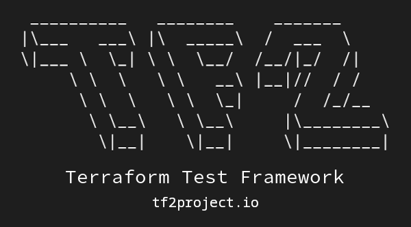

# Terraform Test Framework

<p align="center">
  
</p>

<p align="center">Unified Test Framework to test Terraform codes and Terraform-provisioned infrastructures.</p>

<p align="center">
<strong>The first release, v0.1.0 (Shadowman) is now available.</strong>
</p>

<p align="center">
  
  <a href="https://github.com/tf2project/tf2/blob/master/LICENSE" target="_blank"></a>
  <a href="https://github.com/tf2project/tf2/stargazers" target="_blank"></a>
  <a href="https://github.com/tf2project/tf2/network" target="_blank"></a>
  <a href="https://github.com/tf2project/tf2/issues" target="_blank"></a>
</p>

---

**Documentation:** <a href="https://tf2project.io" target="_blank">https://tf2project.io</a>

**Source Code:** <a href="https://github.com/tf2project/tf2" target="_blank">https://github.com/tf2project/tf2</a>

---

**TF2** is a unified test framework to test Terraform codes and Terraform-provisioned infrastructures. With TF2, you can implement PaC(**Policy as Code**), **Compliance** tests and e2e(**End to End**) tests just in a unified framework.

## Requirements

The **TF2 core** doesn't have any external or third-party requirements, and we will keep this approach as the main development policy to reduce the attack surface. This policy is created because you run the TF2 in your critical environments, CI/CD systems, and cloud/on-premises infrastructures, and we want to keep you completely secure. The TF2 core is just using standard and official Python libraries.

## Installation

On production environment:

```bash
pip install tf2
```

On development environment:

```bash
export ENV=development
pip install tf2
```

## License

This project is licensed under the terms of the Apache 2.0 license.

Copyright &copy; 2022 Saeid Bostandoust
